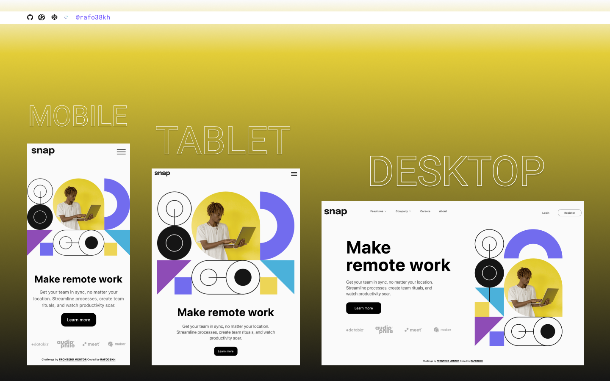

# Frontend Mentor - Intro Section With Dropdown Navigation Solution

This is a solution to the [Intro Section With Dropdown Navigation Challenge on Frontend Mentor](https://www.frontendmentor.io/challenges/intro-section-with-dropdown-navigation-ryaPetHE5)

## Table of contents

- [Overview](#overview)
  - [The challenge](#the-challenge)
  - [Screenshot](#screenshot)
  - [Links](#links)
- [My process](#my-process)
  - [Built with](#built-with)
- [Author](#author)

## Overview

### The challenge

- View the relevant dropdown menus on desktop and mobile when interacting with the navigation links
- View the optimal layout for the content depending on their device's screen size
- See hover states for all interactive elements on the page

### Screenshot

### Links

- Solution URL: [https://www.frontendmentor.io/solutions/intro-section-with-dropdown-navigation-qILIRuiAkK](https://www.frontendmentor.io/solutions/intro-section-with-dropdown-navigation-qILIRuiAkK)
- Live Site URL: [https://intro-section-steel.vercel.app/](https://intro-section-steel.vercel.app/)

## My process

### Built with

- React
- Tailwind CSS
- Mobile-first workflow

## Author

- Frontend Mentor - [@rafo38kh](https://www.frontendmentor.io/profile/rafo38kh)
- GitHub - [@rafo38kh](https://github.com/rafo38kh)
- Codewars - [@rafo38kh](https://www.codewars.com/users/rafo38kh)
